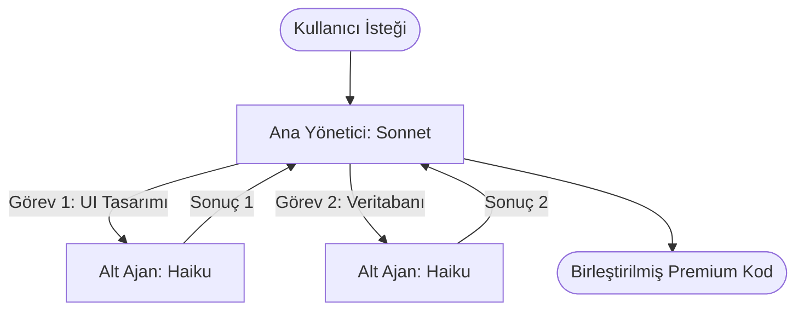

# 🧠 CLAUDE GÜÇ DOSYASI (ADVANCED Claude CAPABILITIES)

Bu dosya, Google NotebookLM tarafından sentezlenen Anthropic'in en ileri düzey yeteneklerini (Prompt Caching ve Sub-agents) projemiz için yapılandırılmış bir rehber olarak içerir.

---

## ⚡ 1. Prompt Caching (İstem Önbelleğe Alma)

Büyük kod tabanları, PDF dökümanları veya uzun konuşma geçmişleri ile çalışırken API gecikmesini ve maliyetini optimize etmek için en etkili araçtır.

### 🛠️ Nasıl Çalışır?
* **Önbelleğe Alma Mantığı:** Claude API'ye gönderilen büyük veri blokları (örneğin, 1000 satırlık bir kod veya kütüphane dokümantasyonu) önbelleğe alınır. Sonraki isteklerde bu veri tekrar yüklenmez, doğrudan önbellekten okunur.
* **Maliyet Tasarrufu:** Önbellekten okunan veriler, normal girdi token fiyatının **%10'una kadar** daha ucuzdur (yaklaşık %90 tasarruf).
* **Gecikme Azaltma (Latency Reduction):** Büyük dökümanların işlenme süresi saniyenin altına düşer, geliştirme hızı 10 kat artar.

### 💻 API Entegrasyon Şablonu
API isteklerinde önbelleğe alınmasını istediğiniz bloğun sonuna `"cache_control": {"type": "ephemeral"}` parametresi eklenir.

```json
{
  "model": "claude-3-5-sonnet-latest",
  "messages": [
    {
      "role": "user",
      "content": [
        {
          "type": "text",
          "text": "[Buraya 50 sayfalık kod tabanı veya doküman gelir]",
          "cache_control": {"type": "ephemeral"}
        },
        {
          "type": "text",
          "text": "Yukarıdaki koda göre yeni API endpoint'ini yaz."
        }
      ]
    }
  ]
}
```

---

## 🤖 2. Sub-agents (Alt-Ajanlar) Mimarisi

Karmaşık ve çok adımlı görevleri (örneğin hem mobil ajan yazıp, hem veritabanını test edip, hem de UI tasarlamak gibi) tek bir modele yaptırmak yerine, işi uzmanlaşmış küçük modellere devretme yöntemidir.

### 📐 Model Hiyerarşisi (Orchestrator-Workers)
1. **Ana Yönetici (Orchestrator - Claude 3.5 Sonnet / Opus):**
   * Kullanıcının büyük hedefini alır.
   * Hedefi küçük alt görevlere böler (Planlama yapar).
   * Alt ajanları (Workers) yönetir ve gelen sonuçları birleştirir.
2. **Alt Ajanlar (Workers - Claude 3.5 Haiku / Flash):**
   * Sadece kendilerine verilen dar kapsamlı görevi (örneğin "veri tabanına tablo ekle" veya "CSS'i düzelt") yerine getirirler.
   * Seri, hızlı ve son derece ucuzdurlar.

### 🔄 İş Akışı Şeması (Workflow)


---

## 🎯 Sessiz Muhafız Projesindeki Uygulaması

Bu iki gücü projemizde şu şekilde kullanıyoruz:
* **Hafif Dosya Yapısı:** `ANTHROPIC_CHEAT_SHEET.md` ve bu `CLAUDE_POWER_FILE.md` dosyalarını projenin kökünde bulundurarak, terminalinizdeki `claude` (Claude Code) aracının bu dosyaları **otomatik olarak önbelleğe almasını (automatic prompt caching)** sağlıyoruz.
* **Ajan İşbirliği:** Ben (Antigravity) projenizin mimari yapısını ve UI estetiğini yöneten **Ana Yönetici** gibi davranırken; terminalinizdeki `claude` CLI aracı komut çalıştırma, hata giderme ve servis derleme gibi yerel işlerde hızlıca devreye giren **Uygulayıcı Alt Ajan** gibi çalışır.

*Bu güç birliği, projemizi en yüksek kalitede ve en düşük maliyetle tamamlamamızı sağlayacaktır.*
